# Цель работы

- прохождение внешнего курса "Введение в Linux"

# Выполнение лабораторной работы

Итак я начала внешний курс

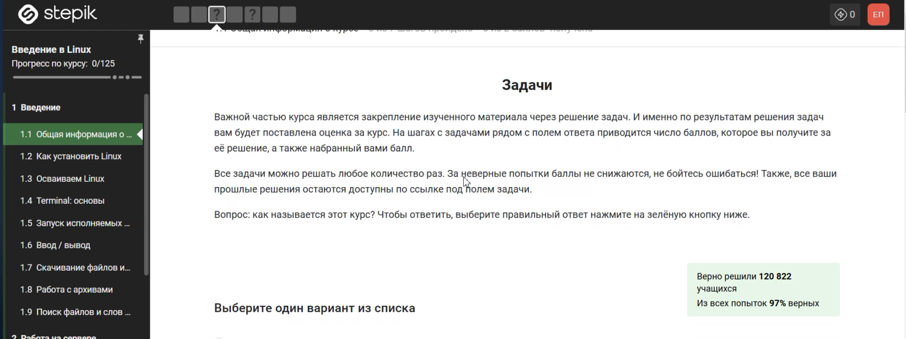

1. Курс называется "Введение в Linux"

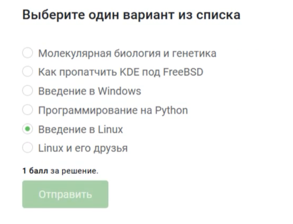

2. Ответы были выбраны в соответствии с описаными критериями

![Задание 2]](2025-05-31_15-58-58.PNG)

3. Лично я пользуюсь только Windows, но отметила также и линукс.

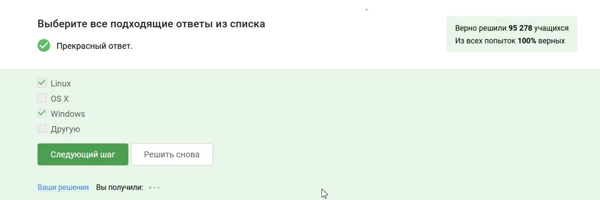

4. VirtualBox - это программа для запуска одной ос на другой

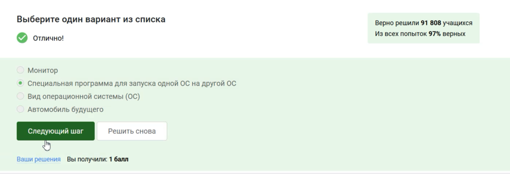

5. У меня действительно получилось установить и запустить машину

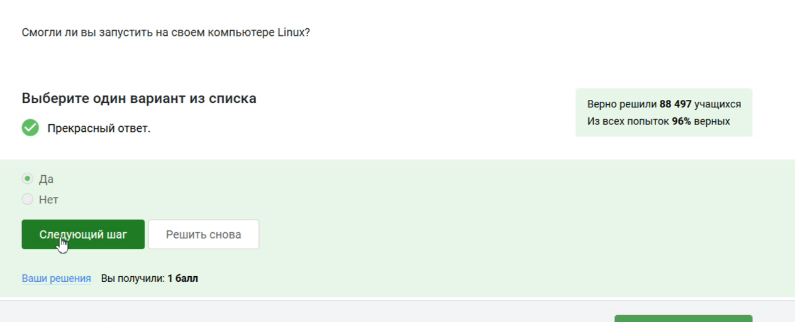

6. Формат deb - это стандартный формат пакетов программного обеспечения для операционных систем семейства Debian (Debian, Ubuntu, Mint и т.д.)

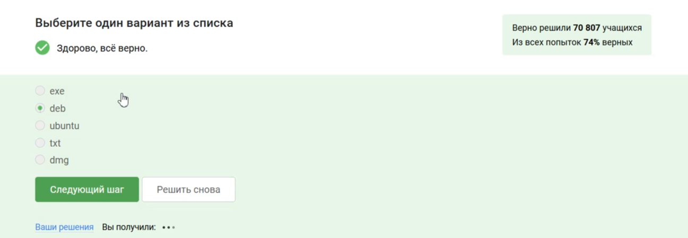

7. Менеджер обновлений — это программа для обновления установленного программного обеспечения в дистрибутивах ОС Linux, основанных на Debian или использующих систему управления пакетами APT. Менеджер обновлений устанавливает обновления безопасности или просто улучшающие функциональность программы.

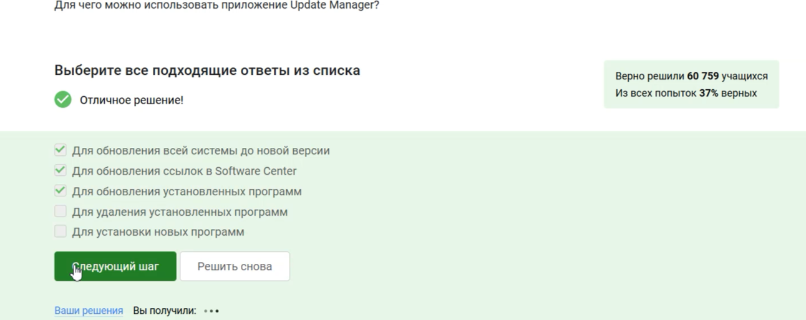

8. Здесь подходят только - Консоль и Терминал остальные варианты не имеют значения

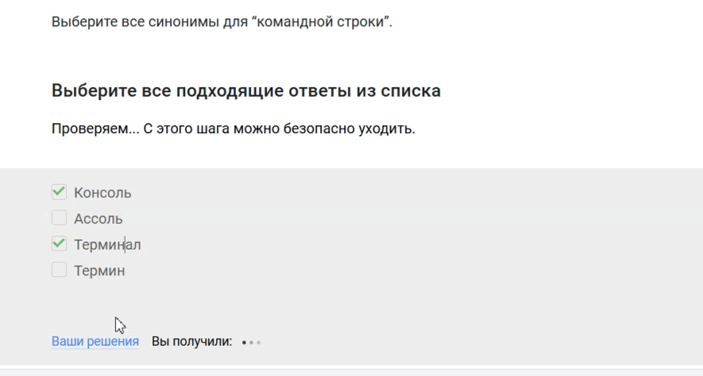

9. Интерфейс Linux - регистрозависимый поэтому только pwd

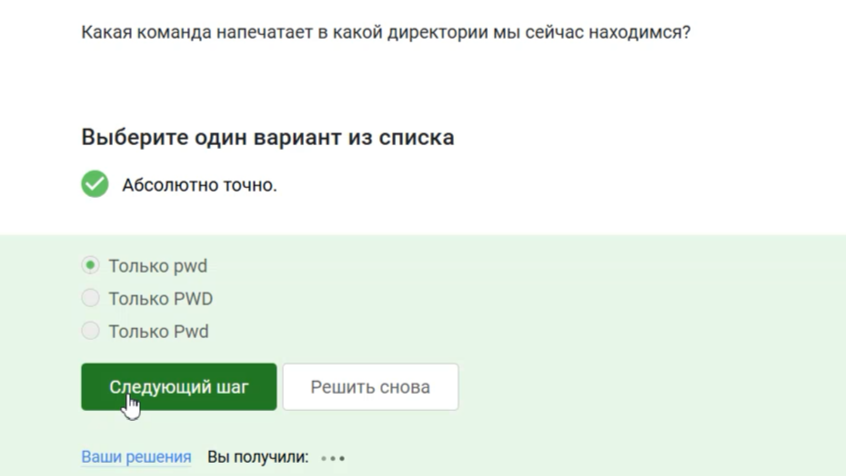

10. В данном случае подходят все варианты так как Linux - регистрозависимый.

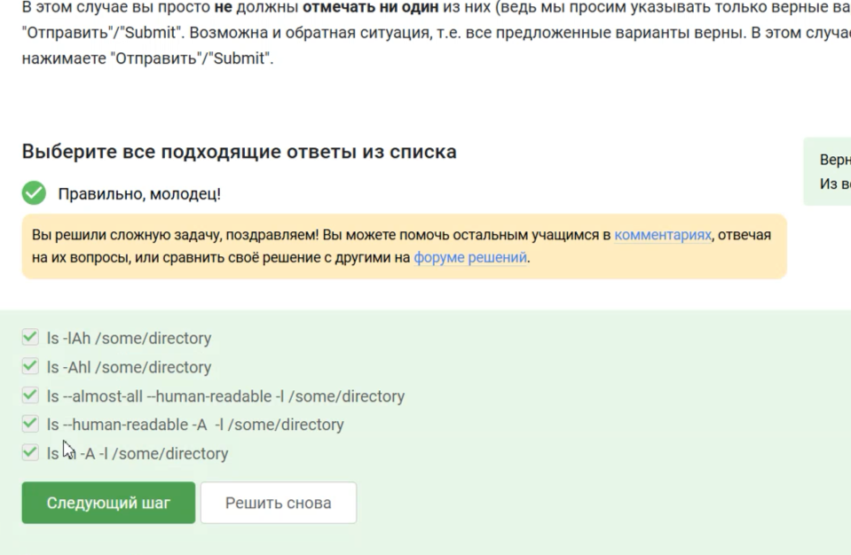

11. Так как я нахожусь в другой директории то мне нужно прописать полный путь до Downloads

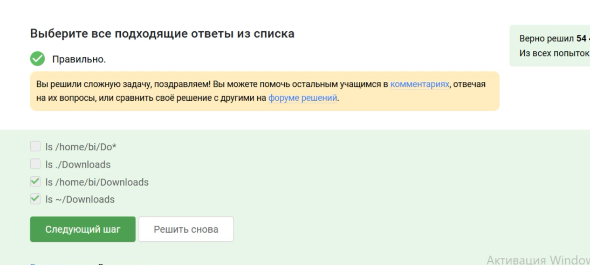

12. rm -r - это удаление директорий и рекурентное удаление файлов находящихся в ней.

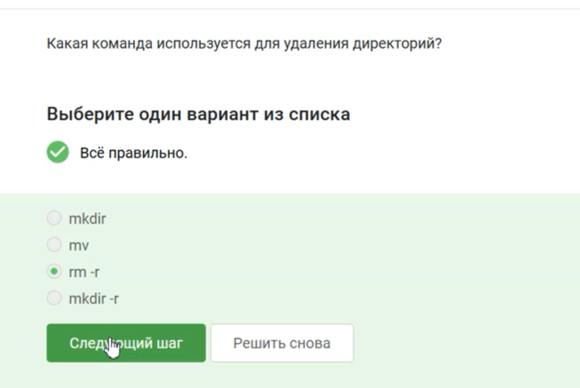

13. Я проверила это просто введя в консоль

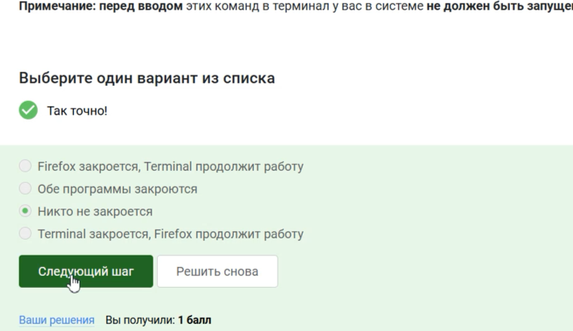

14. Это комбинация для запуска программы в фоновом режиме

15. По моему опыту ошибки автоматически выводятся на экран

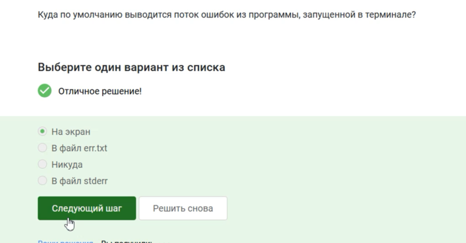

16. < file — использовать файл как источник данных для стандартного потока ввода.
file — направить стандартный поток вывода в файл. Если файл не существует, он будет создан, если существует — перезаписан сверху.
2> file — направить стандартный поток ошибок в файл. Если файл не существует, он будет создан, если существует — перезаписан сверху.
file — направить стандартный поток вывода в файл. Если файл не существует, он будет создан, если существует — данные будут дописаны к нему в конец.
2»file — направить стандартный поток ошибок в файл. Если файл не существует, он будет создан, если существует — данные будут дописаны к нему в конец.
&>file или >&file — направить стандартный поток вывода и стандартный поток ошибок в файл. Другая форма записи: >file 2>&1.

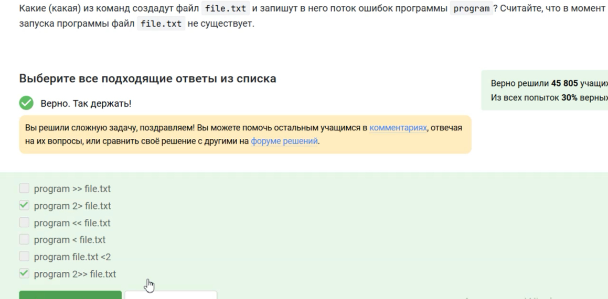

17. Выполнив инструкции, в итоге всё вывелось на экран

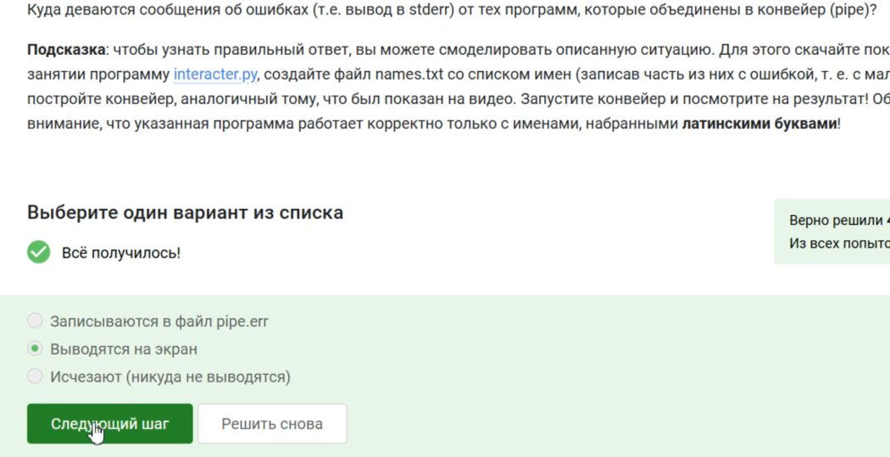

18. q –quiet Turn off Wget’s output

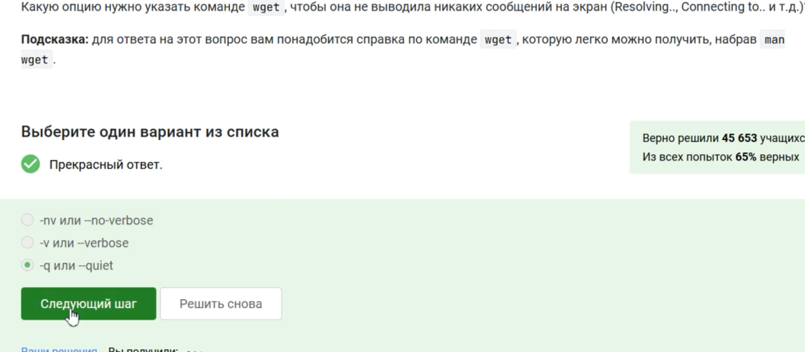

19. При загрузке материалов из Интернета вы часто захотите ограничить поиск только определенными типами файлов. Например, если вы заинтересованы в загрузке GIF-файлов, вы не будете рады получить кучу документов PostScript, и
наоборот.
Wget предлагает две опции для решения этой проблемы. В описании каждой опции перечислены краткое имя, длинное имя и эквивалентная команда в .wgetrc.
‘-A acclist’ ‘–accept acclist’ ‘accept = acclist’ ‘–accept-regex urlregex’ ‘accept-regex =
urlregex’
Аргумент опции '--accept' представляет собой список суффиксов или шаблонов файлов. Таким образом, указав 'wget -A gif,jpg', Wget загрузит только файлы, заканчивающихся на 
A "zelazny*196[0-9]*" загрузит только файлы, начинающиеся с 'zelazny'

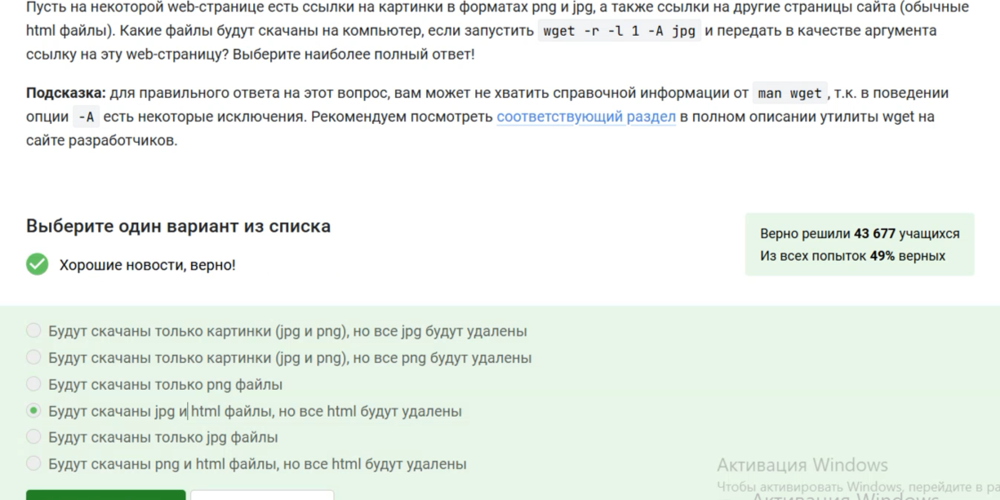

20. gzip (сокращение от GNU Zip) — утилита сжатия и восстановления (декомпрессии) файлов, использующая алгоритм Deflate.

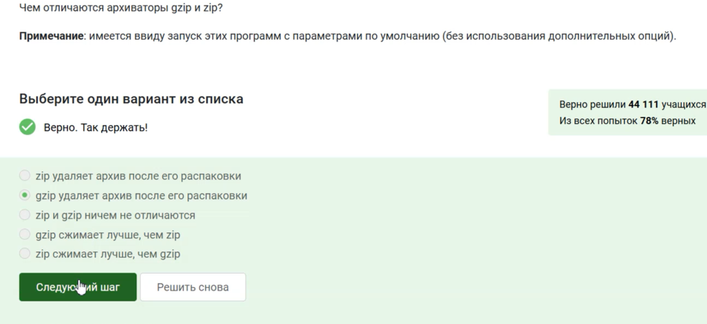

21. 

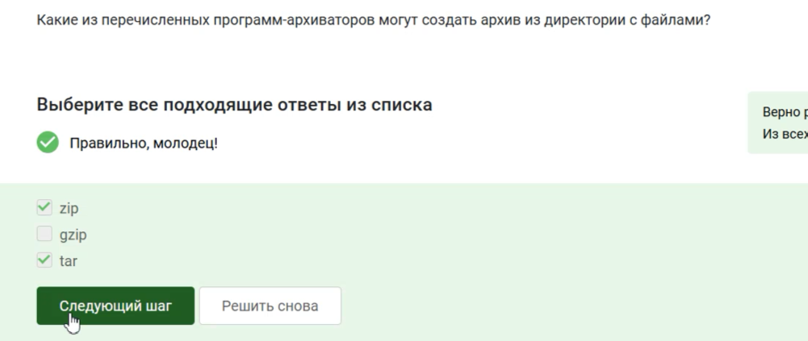

22. c - архиватор
j - указатель на тип архиватора bzip
f - потому что создаем архив в файловой системе

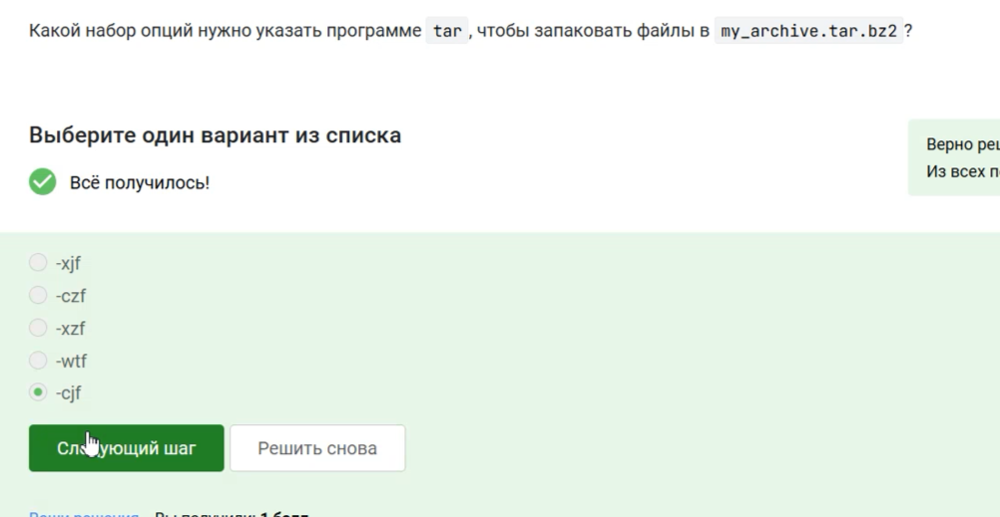

23. ? = один символ
alexey = маленькая буква
И файл должен быть jpeg, а не jpg

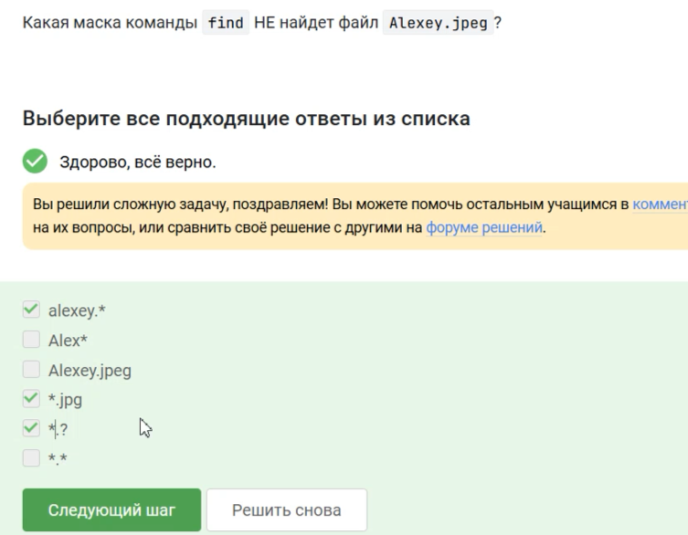

24. Здесь регистр - маленькая буква, слово - world, а не word

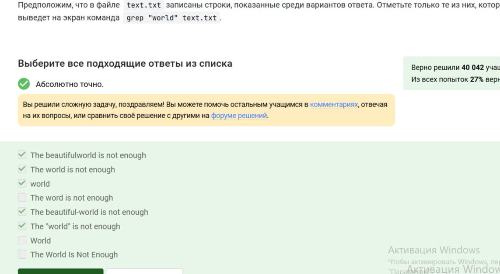

# Вывод

Я закончила первый этап внешнего курса.

